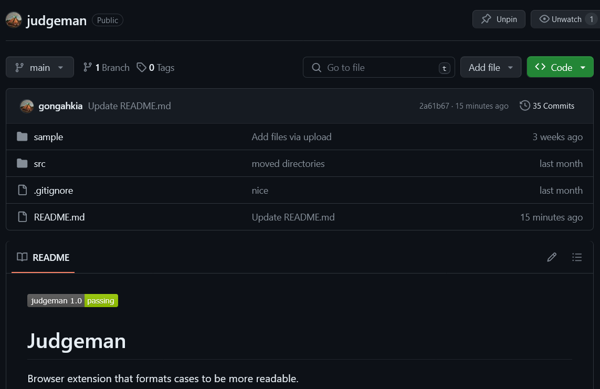
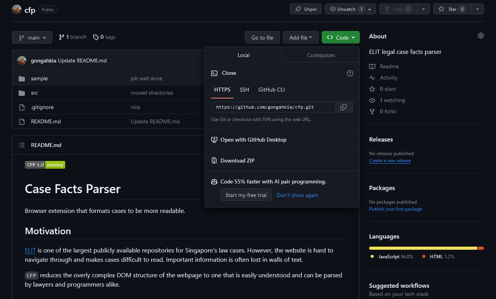

# Case Facts Parser

Browser extension that formats cases to be more readable.

## Motivation

[ELIT](https://www.elitigation.sg/_layouts/IELS/HomePage/Pages/Home.aspx) is one of the largest publicly available repositories for Singapore's law cases. However, the website is hard to navigate through and makes cases difficult to read. Important information is often lost in walls of text.

`CFP` reduces the overly complex DOM structure of the webpage to one that is easily understood and can be parsed by lawyers and programmers alike.

## Purpose

* BLUF, important case information is laid bare
* Speed up reading cases on ELIT
* Browser extension with small source code binary
* Supported on most browsers

## Screenshots


## Installation

### CLI

```console
$ git clone https://github.com/gongahkia/cfp
$ cd cfp
$ rm -r README.md sample
```

### GUI

1. Click *Code*.



2. Click *Download ZIP*.



3. Unzip the ZIP file. 

## Usage

### Firefox
1. Copy and paste this link in the search bar *about:debugging#/runtime/this-firefox*.
2. Click *load temporary add-on*.
3. Open the `CFP` repo, select `manifest.json`.
4. Open any **elit** page.
5. Click the toggle button.

### Chrome

1. Copy and paste this link in the search bar *chrome://extensions/*.
2. Toggle *Developer mode* on.
3. Click *load unpacked*.
4. Open the `CFP` repo, click *select*.
5. Open any **elit** page.
6. Click the toggle button.

Support for other browsers like Opera, Vivaldi have not been extensively tested, but this extension should work. Open an issue for further support.
