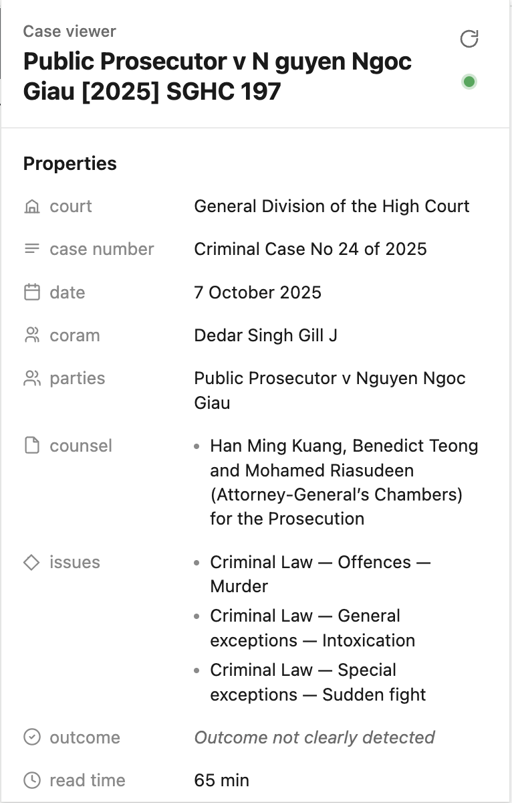
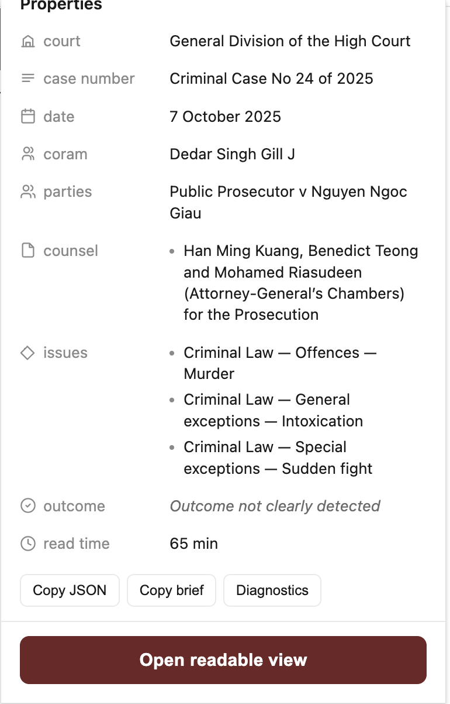
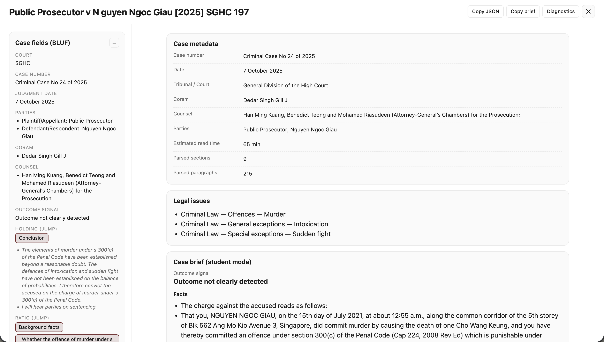
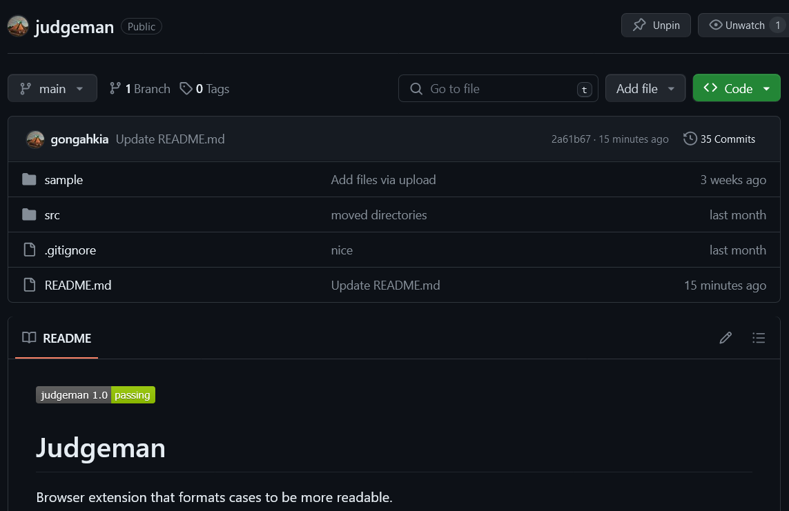
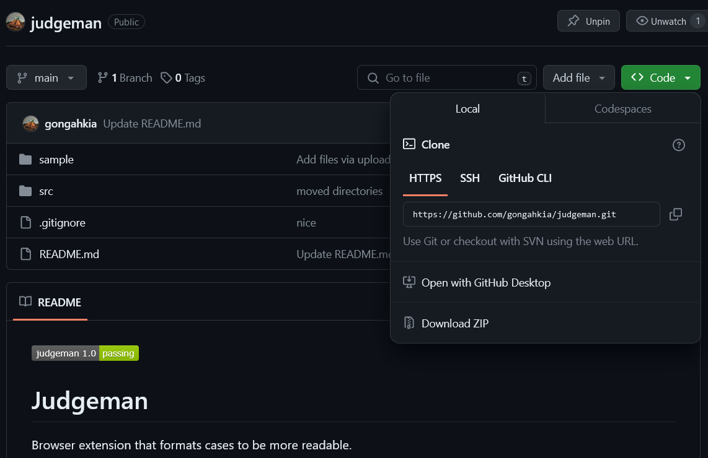

[](https://github.com/gongahkia/judgeman/releases/tag/1.0)
[](https://github.com/gongahkia/judgeman/releases/tag/2.0)
[](https://github.com/gongahkia/judgeman/releases/tag/3.0)
[](https://github.com/gongahkia/judgeman/releases/tag/4.0)

# `Judgeman`

Browser extension that formats cases to be more readable.

## Motivation

[ELIT](https://www.elitigation.sg/_layouts/IELS/HomePage/Pages/Home.aspx) is one of the largest publicly available repositories for Singapore's law cases. However, the website is hard to navigate through and makes cases difficult to read. Important information is often lost in walls of text.

`Judgeman` reduces the overly complex DOM structure of the webpage to one that is easily understood and can be parsed by lawyers and programmers alike.

## Purpose

* BLUF, important case information is laid bare
* Speed up reading cases on ELIT
* Browser extension with small source code binary
* Supported on most browsers

## Screenshots

  
  
  

## Installation

### CLI

```console
$ git clone https://github.com/gongahkia/judgeman
$ cd judgeman
$ rm -r README.md sample
```

### GUI

1. Click *Code*.



2. Click *Download ZIP*.



3. Unzip the ZIP file. 

## Usage

### Firefox
1. Copy and paste this link in the search bar *about:debugging#/runtime/this-firefox*.
2. Click *load temporary add-on*.
3. Open the `judgeman` repo, select `manifest.json`.
4. Open any **elit** page.
5. Click the toggle button.

### Chrome

1. Copy and paste this link in the search bar *chrome://extensions/*.
2. Toggle *Developer mode* on.
3. Click *load unpacked*.
4. Open the `judgeman` repo, click *select*.
5. Open any **elit** page.
6. Click the toggle button.

Support for other browsers like Opera, Vivaldi have not been extensively tested, but this extension should work. Open an issue for further support.

## Privacy

`Judgeman` is an offline-first reader for Singapore's ELIT. There is no telemetry, no remote logging, and no account.

### No-AI mode (default)

The shipped extension reads, parses, and reformats ELIT judgments entirely on-device. No judgment text, page URL, or extracted data leaves the browser. Use this mode if you want the cleanest reader posture with no third-party calls.

### BYOK AI mode (experimental, opt-in)

The `judgeman_v4/experimental_ai/` add-on lets you bring your own API key (currently Gemini). When enabled:

* the key is stored only in `chrome.storage.sync` for your profile and never transmitted to any Judgeman-owned endpoint;
* extracted case data is sent **only** to the provider you selected (e.g. `generativelanguage.googleapis.com`) for the request you triggered;
* no data is retained server-side by Judgeman — we run no servers;
* AI output is best-effort and may be wrong. Prompts include explicit anti-fabrication guardrails, but you should treat every AI response as **not legal advice**.

### Hosted AI / local-only AI

Not shipped. If you want a hosted backend or a local model (Ollama, WebLLM), the experimental BYOK flow is the supported path — point it at your own endpoint.

### Store-listing summary

> Judgeman is an on-device reader for Singapore court judgments published on ELIT. Default mode performs no network calls beyond loading the page itself. An opt-in experimental module lets advanced users connect their own AI provider API key; in that mode, only data the user triggers is sent to the provider they chose. AI output is not legal advice.

## References

The name `Judgeman` is in reference to the cursed technique of [Hiromi Higuruma](https://jujutsu-kaisen.fandom.com/wiki/Hiromi_Higuruma) (日車寛見), a defense attorney who rose to prominence in the [culling game arc](https://jujutsu-kaisen.fandom.com/wiki/Culling_Game_Arc) of the manga series [Jujutsu Kaisen](https://jujutsu-kaisen.fandom.com/wiki/Jujutsu_Kaisen_Wiki).


