# `Dorso`

Rakuzaichi adds an open-threads layer over your vault, surfacing TODO/FIXME/REF/PROMPT-style follow-ups from explicit tags and local extraction.

Everything lives on-device in IndexedDB, with Obsidian sync, encrypted backups, and offline exports for 15 LLM platforms.

## Rationale

The 2025 software development experience involves reaching for the closest AI chatbot available, then battling the urge to [punt your laptop across the room](https://media1.tenor.com/m/nJW6x9jzp1AAAAAC/mob-psycho100-mob-psycho.gif) when the chatbot can't understand your poorly worded prompt.

Worried that the convenience and availability of web-based AI chatbots were [making programmers dumber](https://andrewzuo.com/is-ai-making-programmers-stupid-115e9d6e7460), I created `Dorso`.

`Dorso` is a client-sided browser extension that monitors web activity and forces users to correctly answer a **Leetcode question** before allowing them access to their [AI chatbot](#details) of choice for the next 15 minutes.

## Stack

* *Script*: [JavaScript](https://developer.mozilla.org/en-US/docs/Web/JavaScript)
* *Backend*: [Python](https://www.python.org/), [Gunicorn 21](https://gunicorn.org/)
* *API*: [Chrome WebExtension API](https://developer.chrome.com/docs/extensions/), [Firefox WebExtension API](https://developer.mozilla.org/en-US/docs/Mozilla/Add-ons/WebExtensions), [LocalStorage API](https://developer.mozilla.org/en-US/docs/Web/API/Window/localStorage), [LeetCode GraphQL API](https://leetcode.com/graphql) 
* *DB*: [Django](https://www.djangoproject.com/), [Django REST](https://www.django-rest-framework.org/), [PostgreSQL](https://www.postgresql.org/)
* *Cache*: [Redis](https://redis.io/)
* *Observability*: [Prometheus](https://github.com/prometheus/client_python), [Grafana](https://grafana.com/) 
* *Logs*: [structlog](https://www.structlog.org/)
* *CI/CD*: [GitHub Actions](https://github.com/features/actions), [Pytest](https://docs.pytest.org/), [Jest](https://jestjs.io/), [Playwright](https://playwright.dev/) 
* *Package*: [Docker](https://www.docker.com/) 

## Screenshot

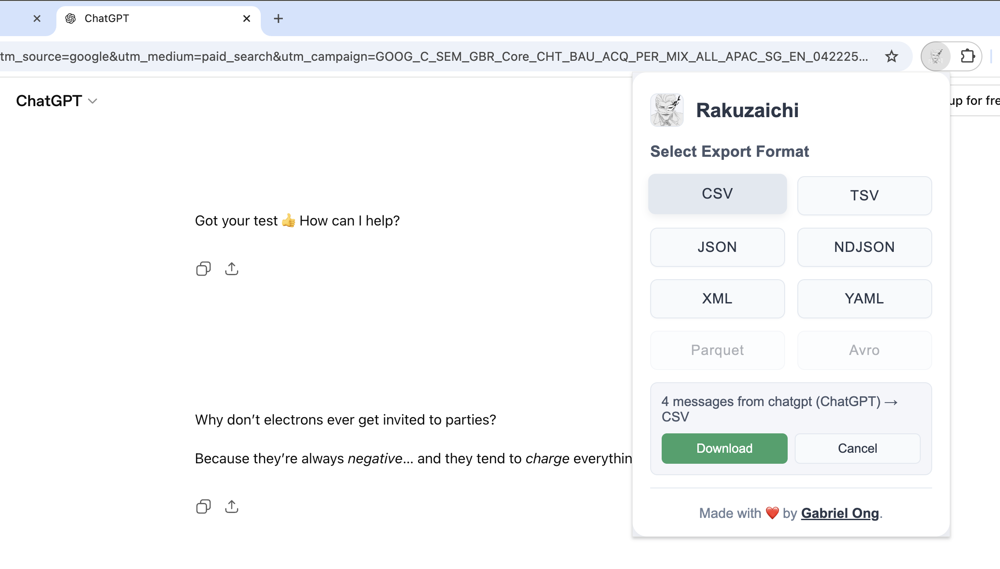

## Details

### Versions

* `Dorso v1.0.0` is available as an Add-on for Firefox [here](https://addons.mozilla.org/en-US/firefox/addon/dorso/).
* `Dorso v2.0.0` is available as an Add-on for Firefox [here](https://addons.mozilla.org/en-GB/firefox/addon/dorso-2/).

### Blacklist

`Dorso` checks for web-based AI chatbot access off the following blacklist.

* https://chatgpt.com/
* https://www.perplexity.ai/
* https://gemini.google.com/app
* https://claude.ai/
* https://www.deepseek.com/
* https://copilot.microsoft.com/
* https://socrat.ai/
* https://huggingface.co/chat/
* https://writesonic.com/chat
* https://you.com/
* https://www.jasper.ai/

### Supported browsers

Find `Dorso` on the [Chrome Web Store](https://chromewebstore.google.com) or [Firefox browser Add-ons](https://addons.mozilla.org/en-US/firefox/).

| Browser | Status | Link |
| :--- | :--- | :--- |
| Firefox |  | [addons.mozilla.org/en-US/firefox/addon/dorso/](https://addons.mozilla.org/en-US/firefox/addon/dorso/) |
| Google Chrome | Coming soon (Chrome Web Store review in progress) | NIL |
| Safari | Deferred past v3.0 | NIL |

## Architecture

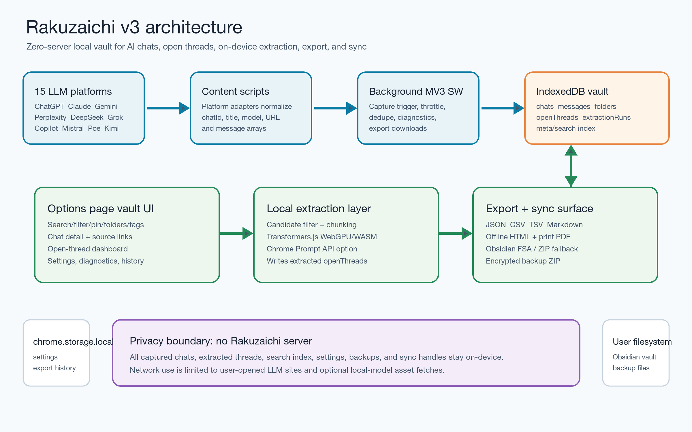

## Usage

> [!IMPORTANT]
> Read the [legal disclaimer](#legal-disclaimer) before using `Rakuzaichi`.
> Read the [privacy policy](./PRIVACY.md) for local storage, model-download, and host-permission details.

> [!TIP]  
> More tags *(or custom tags)* might be added in the future. Open an issue to feedback!

## Colorschemes

Find instructions to change your colorscheme [here](#configurations).

| Colorscheme | Example |
| :--- | :---: |
| Gruvbox | 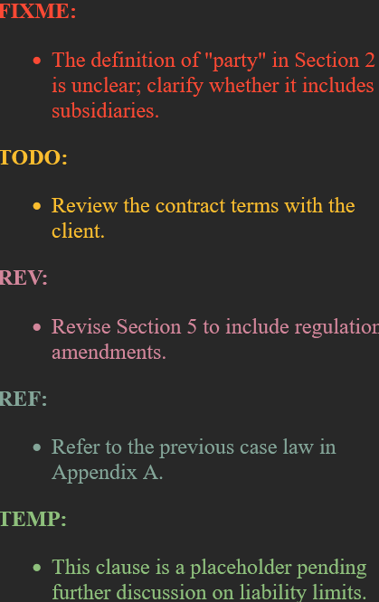 |
| Everforest | 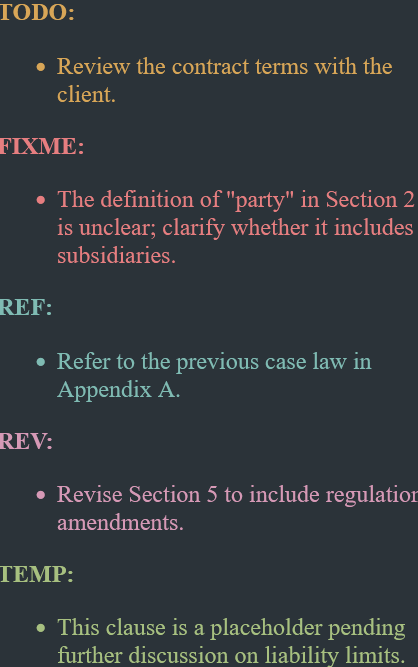 |
| Tokyo Night | 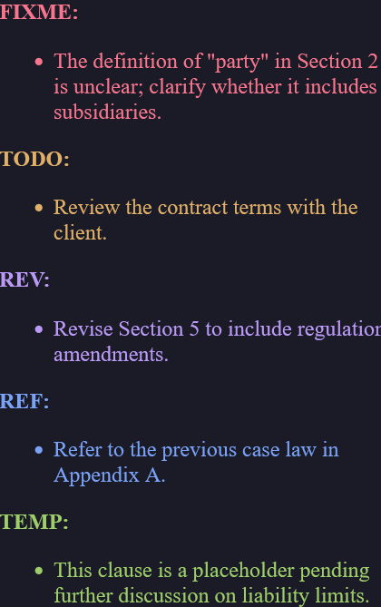 |
| Atom Dark | 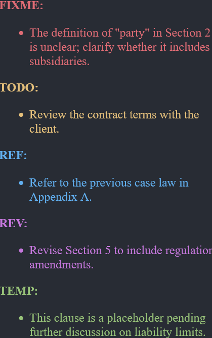 |
| Monokai | 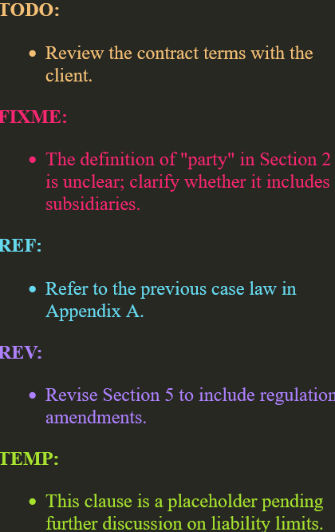 |
| Github | 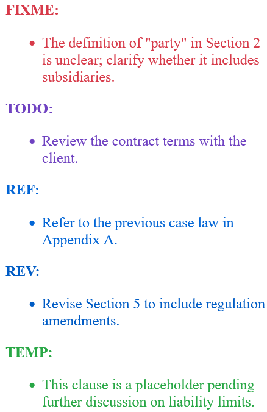 |
| Ayu | 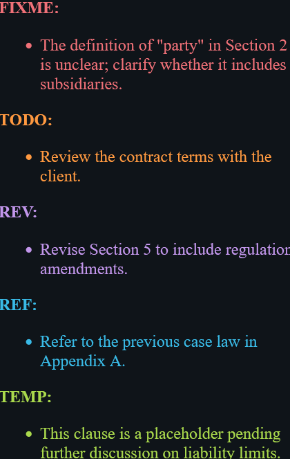 |
| Dracula | 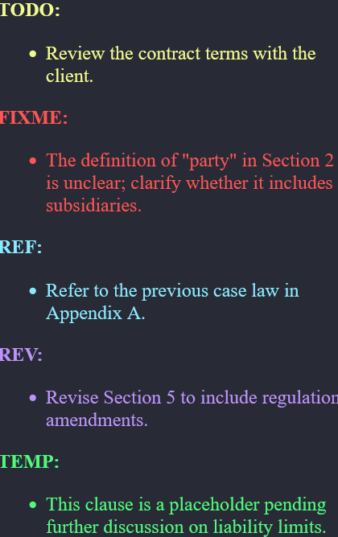 |
| Rose Pine | 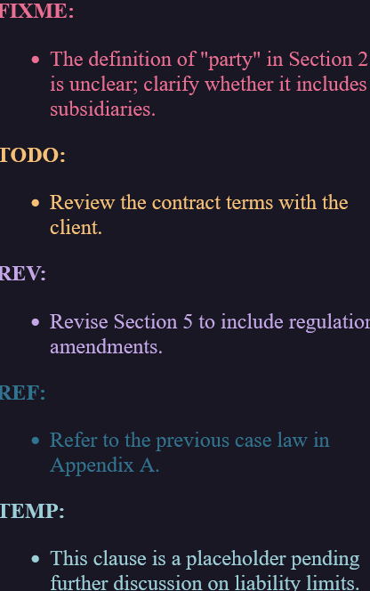 |
| Spacemacs | 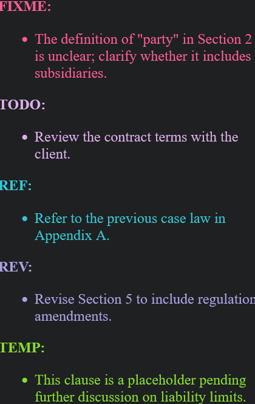 |

## Configurations

For detailed installation and configuration instructions, see [`INSTRUCTIONS.md`](./INSTRUCTIONS.md).

## Deployment 

Support for other browsers like Opera, Vivaldi have not been extensively tested, but this extension should work. Open an issue for further support.

## Origins

Owl history was merged into Rakuzaichi on 2026-06-14 via merge commit `51e556a66bdd4901386c078bebab4a9a1f270ca3`; Owl's tree was not imported.

## License

MIT. See [LICENSE](./LICENSE).

## Legal disclaimer

The Rakuzaichi browser extension ("Rakuzaichi") is provided "AS IS" and "AS AVAILABLE," without warranty of any kind, express or implied. By using Rakuzaichi, you acknowledge that you have read, understood, and agree to be bound by this disclaimer's below terms and limitations.

2. **User Responsibility**: You are solely responsible for ensuring that you have adequate backups of your data and that you understand the risks associated with using this extension. 

3. **Compliance with Laws**: You are responsible for ensuring compliance with all applicable laws and regulations regarding the use of this extension and any data it may process.

4. **Modification and Updates**: The developer reserves the right to modify or discontinue the extension at any time without notice. The functionality may change over time, and while efforts will be made to keep it stable, no guarantees are made regarding its performance.

5. **Third-Party Services**: The `Owl` extension interacts with third-party services (such as Google Docs, Sheets, and Slides). The developer is not responsible for any issues arising from these interactions or from changes in third-party services.

6. **Indemnification**: You agree to indemnify and hold harmless the developer from any claims, losses, liabilities, damages, costs, or expenses (including reasonable attorney fees) arising out of your use of this extension.

Data exported by Rakuzaichi in JSON, Markdown, CSV, TSV, PDF, HTML, or other formats may contain limitations, inconsistencies, or formatting issues. Users should:
* Not rely solely on exported chat data for critical decisions
* Verify all information against the original chat interfaces
* Understand that format conversion may result in partial data loss or transformation
* Be aware that exported data may not include all metadata from the original chat platform

## References

The name `Owl` is in reference to the [second technique](https://kagurabachi.fandom.com/wiki/Seiichi_Samura#Techniques) of [Tobimune](https://kagurabachi.fandom.com/wiki/Enchanted_Blade#Tobimune) (飛宗), the [enchanted blade](https://kagurabachi.fandom.com/wiki/Enchanted_Blade) wielded by the contracted sword bearer [Seiichi Samura](https://kagurabachi.fandom.com/wiki/Seiichi_Samura) (座村清市) during the [Seitei War](https://kagurabachi.fandom.com/wiki/Seitei_War). [Owl](https://kagurabachi.fandom.com/wiki/Seiichi_Samura#Techniques) first appears during the [Sword Bearer Assassination arc](https://kagurabachi.fandom.com/wiki/Sword_Bearer_Assassination_Arc) of the manga series [Kagurabachi](https://kagurabachi.fandom.com/wiki/Kagurabachi_Wiki).

### Intellectual Property

Users are responsible for ensuring they have the necessary rights to export and use chat conversations processed through Rakuzaichi. The extension does not claim ownership of user-accessed content, but users grant Rakuzaichi the right to process and convert such content for the purpose of providing export services.

### Third-Party Services

Rakuzaichi interacts with third-party services including but not limited to various AI chatbot platforms. The use of these services is subject to their respective terms and conditions. Rakuzaichi's creators are not responsible for the performance, availability, or policies of these third-party services.

### Data Privacy

Information processed through Rakuzaichi may be temporarily handled within the extension's operation. By using Rakuzaichi, you acknowledge that:
* The extension processes conversation data that may contain personal information
* You have the right to export the data you're accessing
* Exported data becomes your responsibility to store and handle securely
* Users should review the terms of service of the original chat platforms regarding data export permissions

### Limitation of Liability

Under no circumstances shall Rakuzaichi's creators or contributors be liable for any indirect, incidental, special, consequential, or punitive damages resulting from your use of or inability to use the extension. Rakuzaichi is not liable for any decisions made or actions taken based on the exported data provided.

### Compliance with Terms of Service

Users are responsible for ensuring their use of Rakuzaichi complies with the terms of service of the AI chat platforms from which they export data. Rakuzaichi does not encourage or support circumventing any restrictions placed by these platforms.

### Changes to Disclaimer

This disclaimer may be updated from time to time without notice. It is your responsibility to review this disclaimer periodically for changes.

### Termination of Service

Rakuzaichi reserves the right to modify, suspend, or discontinue the extension or any part thereof at any time without prior notice or liability.

## Etymology

The name `Rakuzaichi` references the [Rakuzaichi Auction House](https://kagurabachi.fandom.com/wiki/Rakuzaichi_Auction_House) (楽座市) owned by the [Sazanami Clan](https://kagurabachi.fandom.com/wiki/Sazanami_Clan) (漣家), the main setting for the [Rakuzaichi Arc](https://kagurabachi.fandom.com/wiki/Rakuzaichi_Arc) of [Kagurabachi](https://kagurabachi.fandom.com/wiki/Kagurabachi_Wiki).

